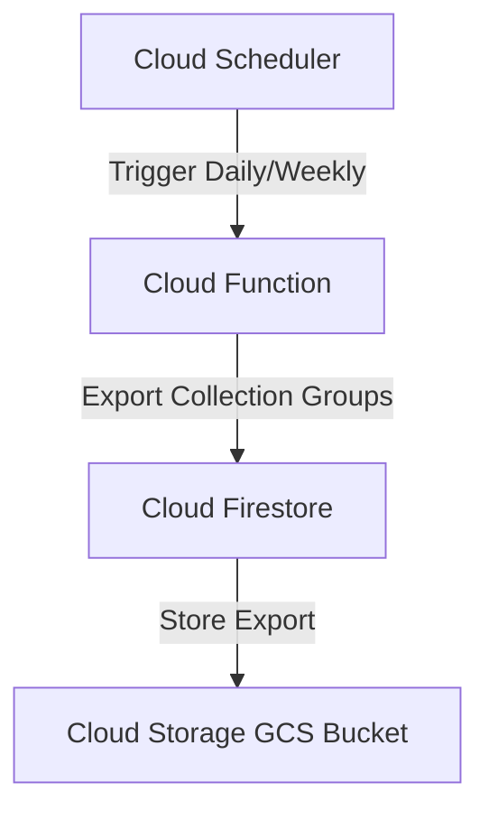

# Production Backup & Recovery Strategy

This document outlines the backup, retention, and disaster recovery policies for the Fresh Market production database (Firestore).

---

## 1. Automated Scheduled Backups

Firestore backups are automated using a serverless architecture combining **Cloud Scheduler** and **Cloud Functions** / **gcloud commands**.



### Cloud Scheduler Cron Configurations
* **Daily Export**: Triggered every day at 02:00 UTC.
  * Cron Expression: `0 2 * * *`
* **Weekly Export**: Triggered every Sunday at 03:00 UTC.
  * Cron Expression: `0 3 * * 0`

> [!IMPORTANT]
> The target Cloud Storage bucket must be located in the same region as the Firestore database instance to minimize egress cost and maximize import/export speed.

---

## 2. Retention Policies

Backup retention is enforced via **GCS Object Lifecycle Management Rules** defined on the backup storage bucket.

| Backup Tier | Frequency | Retention Window | GCS Lifecycle Rule |
| :--- | :--- | :--- | :--- |
| **Daily Backups** | Every 24 hours | 7 Days | Delete objects older than 7 days with prefix `/daily/` |
| **Weekly Backups** | Every Sunday | 30 Days | Delete objects older than 30 days with prefix `/weekly/` |
| **Monthly Archive** | 1st of every month | 365 Days | Move objects with prefix `/monthly/` to Coldline storage after 30 days; delete after 365 days |

---

## 3. Point-in-Time Recovery (PITR)

To protect against accidental writes, deletions, or logical corruptions, Point-in-Time Recovery (PITR) is enabled on the Firestore database instance.

### PITR Specifications
* **Recovery Window**: Up to 7 days in the past.
* **Granularity**: Recover data at any specific microsecond timestamp within the 7-day window.
* **Commands to Restore (CLI)**:
  ```bash
  gcloud firestore databases restore \
    --destination-database='fresh-market-restore-db' \
    --restore-time='2026-06-18T10:15:30Z' \
    --source-database='(default)'
  ```

> [!WARNING]
> PITR restoration must be performed to a new database instance. You cannot overwrite the active running live database instance directly using PITR restore.

---

## 4. Disaster Recovery (DR) Drill Procedures

To ensure operational readiness, database restoration drills must be executed semi-annually.

### Step-by-Step Restoration Drill

1. **Provision Staging Bucket & DB**:
   Create a test database instance in the Firebase console or via CLI:
   ```bash
   gcloud firestore databases create --database='dr-drill-db' --location='europe-west3'
   ```
2. **Execute GCS Import**:
   Import the latest production daily backup from the GCS bucket into the drill database:
   ```bash
   gcloud firestore import gs://fresh-market-backups/daily/latest-backup-folder --database='dr-drill-db'
   ```
3. **Verify Data Integrity**:
   Verify counts and index states on key collections (`products`, `orders`, `users`, `audit_logs`).
4. **Clean Up**:
   Deprovision and delete the drill database instance to avoid storage charges:
   ```bash
   gcloud firestore databases delete --database='dr-drill-db'
   ```

---

## 5. Security & Compliance

* **Encryption**: All exported backups stored in Cloud Storage are encrypted at rest by default using Google-managed encryption keys (or customer-managed encryption keys, if required by compliance).
* **Access Control**: IAM policies restrict write access to the backup GCS bucket exclusively to the Cloud Scheduler service account. Admin-only read permissions are required to download or import backups.
